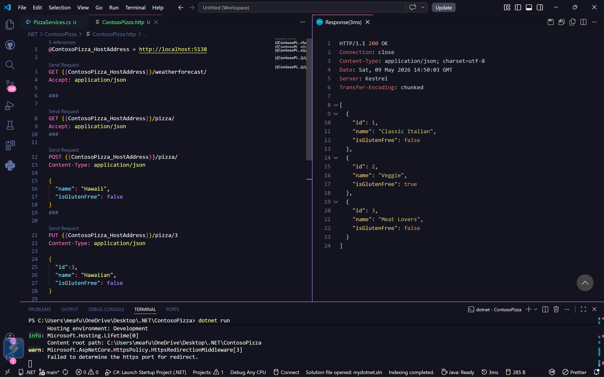
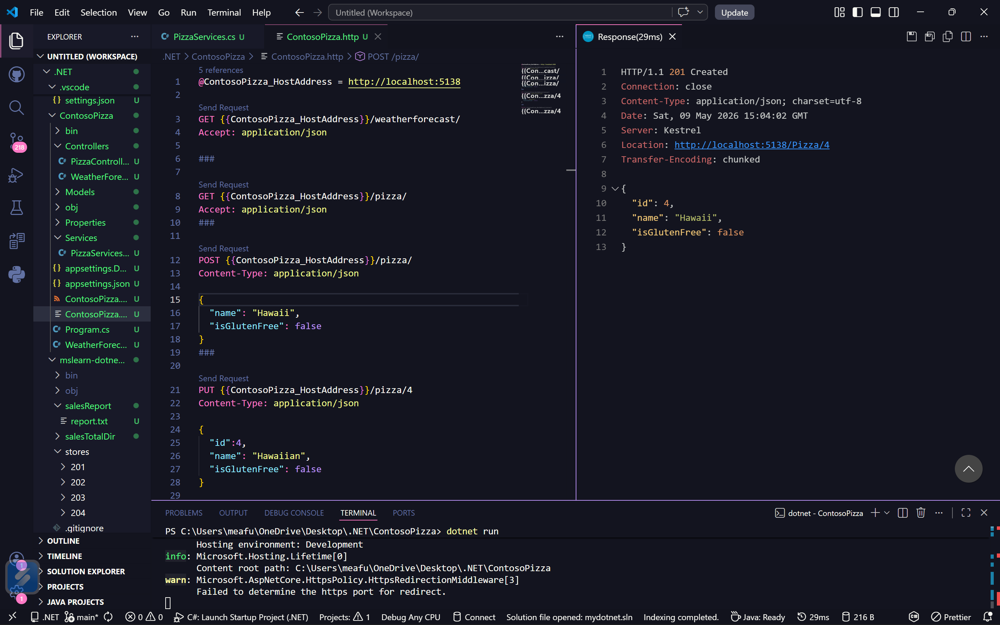
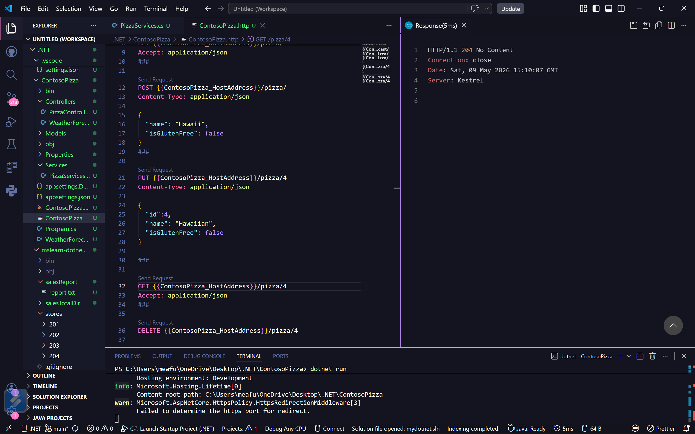
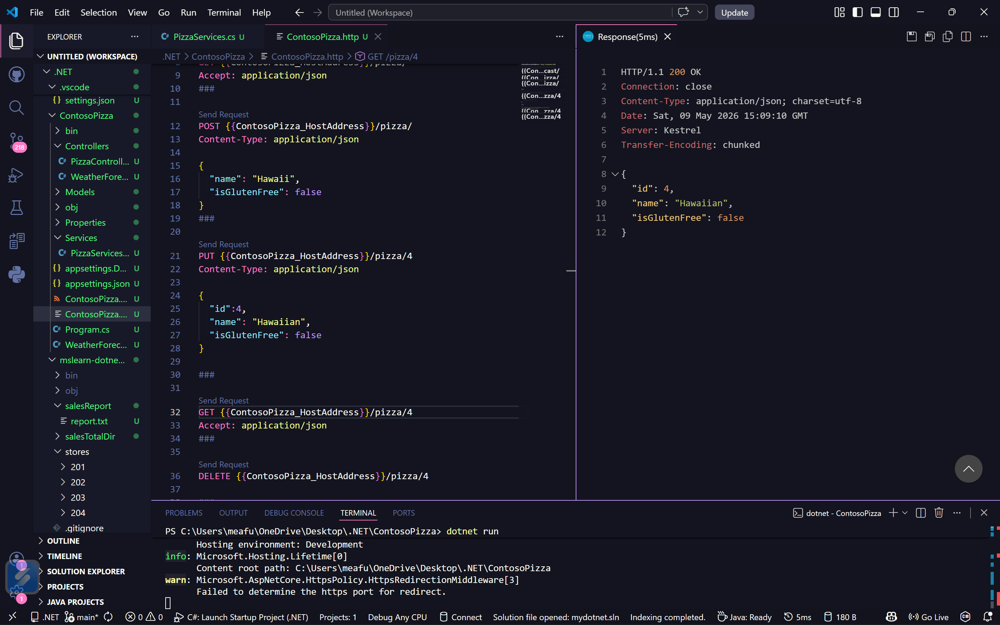
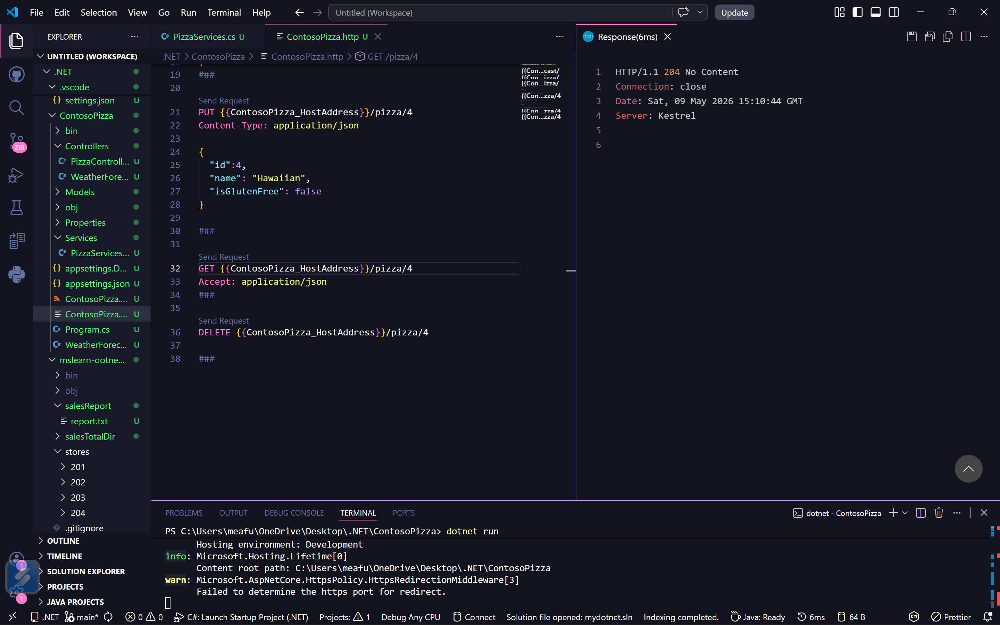

# Build .NET Applications with C#

## ContosoPizza
Pizza REST API with full CRUD operations built with ASP.NET Core controllers.

### GET all pizzas — `200 OK`


### POST new pizza — `201 Created`


### PUT update pizza — `204 No Content`


### GET by id (verify update) — `200 OK`


### DELETE pizza — `204 No Content`


---

## mslearn-dotnet-files
Console app that reads store sales data and generates a summary report.


### Sales Summary Report

Output from `mslearn-dotnet-files/salesReport/report.txt`:

[View report.txt](./mslearn-dotnet-files/salesReport/report.txt)
```
Sales Summary 
----------------------
Total Sales: $1,923.32

Details:
201 sales.json: $501.22
202 sales.json: $1,234.22
203 sales.json: $99.00
204 sales.json: $88.88
```
## mydotnet
Debugging tutorial using a Fibonacci sequence to explore `System.Diagnostics`.

## Submission
Links for submissions are above or can be found at: 
- Screenshots of API operations are in the `screenshots` folder
- Sales summary report output is in `mslearn-dotnet-files/salesReport/report.txt`